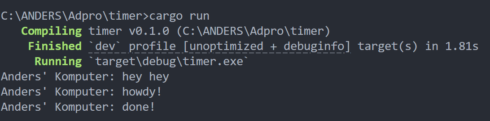
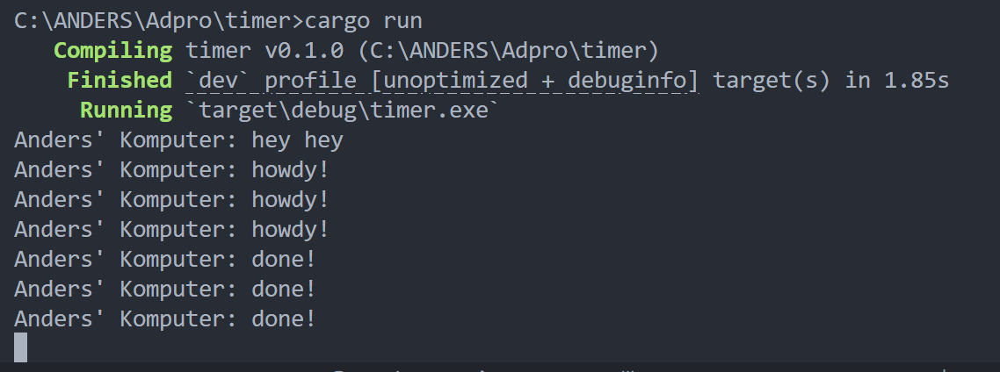
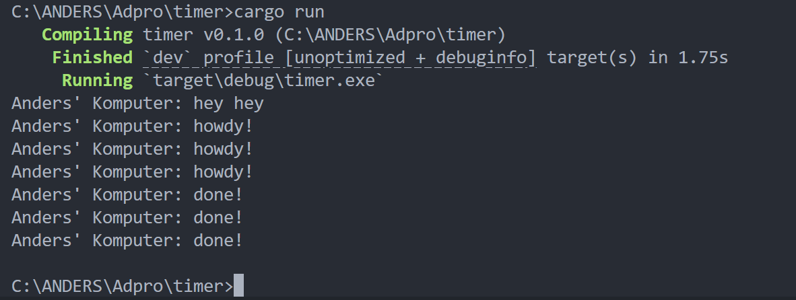

# Tutorial 10 (Timer)

## Reflection

### 1.2. Understanding how it works.

When this code runs, "Ade's Komputer: hey hey" is printed immediately after the task is spawned, before "Ade's Komputer: done!" appears. This happens because the println statement outside the async block executes in the main thread as part of the sequential flow while the spawned task runs asynchronously. Its because code outside the async block continues execution without waiting for the async task to complete, allowing the program to perform other operations while waiting for async operations to finish. 

### 1.3. Multiple Spawn and removing drop

#### Remove Drop

#### Drop

By removing `drop(spawner);`, the executor remains open to receiving new tasks and does not know when to stop processing, potentially causing the program to hang or wait indefinitely. When `drop(spawner);` is included, the executor knows that all tasks have been spawned and can safely run until the queue is empty and then exit. Removing this statement demonstrates the importance of explicitly indicating task completion for proper executor shutdown.